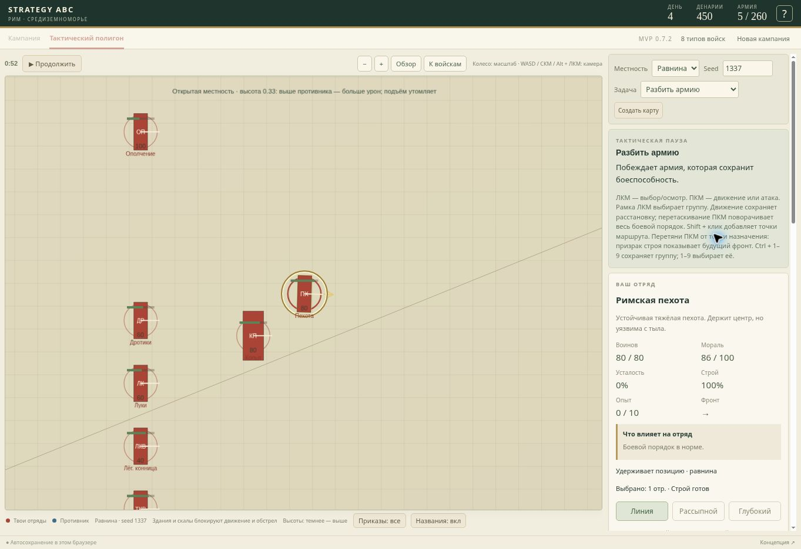

# 0.7.2 — движение при касании углами строя

При касании соседнего отряда краем строя движение могло остановиться навсегда. Прежний обход замечал в основном союзников перед центром отряда. Кроме того, поворот выполнялся до проверки следующего шага: угол прямоугольного строя мог войти в соседний строй, после чего шаг отклонялся, а следующий поворот повторял проблему.

Теперь поворот и перемещение проверяются как одна поза относительно положения в начале шага. Если поворот не помещается, но движение безопасно, отряд делает шаг с прежним фронтом. Если прямой шаг блокируется союзником, проверяются безопасные боковые направления и движение вдоль разделяющей оси. Выбранная сторона обхода запоминается для данного препятствия и приказа, чтобы уменьшить метания. Если безопасного шага нет, неудавшийся поворот откатывается. Уже имеющееся пересечение может только уменьшаться; новое пересечение не разрешается. Незначительные ошибки округления не вызывают постоянных микротолчков.

Столкновения и контактный бой сохраняются. Обход применяется к союзному препятствию; контакт с врагом остаётся возможностью для рукопашной. При боковом обходе сбрасывается кавалерийский разгон, а в эффектах появляется «Обход соседнего отряда». Очередь приказов продолжает выполняться после обхода.

Проверки включают шесть воспроизведённых положений углового контакта, проход возле союзника без его принудительного сдвига, очередь из двух приказов и встречное движение двух наклонённых строев. Сохраняются проверки тыловых атак, плотных рядов, обхода неподвижных союзников и боёв восьми отрядов под управлением ИИ. TypeScript, сборка и 76 автоматических тестов.

## Проверка на GitHub Pages

На полигоне 0.7.2 поставлены пехота в точку (400, 700) и неподвижные копейщики в рассыпном строю в точку (460, 774). Ширина этих двух строев перекрывается на одну единицу поперёк пути, поэтому прямой марш раньше заканчивался касанием уголка. После старта пехоте выдан приказ идти в (550, 700). Пехота прошла соседний строй, достигла назначенной точки и перешла к удержанию позиции; копейщики остались в исходной точке. Проверка выполнена через обычное управление на карте.

