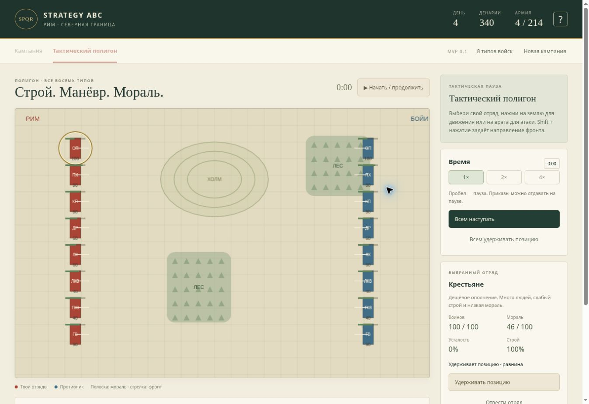

# MVP 0.2: Рим — северная граница

Обновление карты и генератора: [terrain.md](terrain.md).

## Сценарий

Историческая основа: Римская республика в конце III века до н. э. и бойи в Северной Италии. Бойи и инсубры были среди кельтских противников Рима в Цизальпинской Галлии. Выбранные города и армии образуют условную игровую кампанию; дорожная сеть и контуры — игровая модель, не историческая реконструкция.

Источник: [The Latin Library: Cisalpine Gaul, справка с атрибуцией Encyclopaedia Britannica](https://www.thelatinlibrary.com/historians/notes/cisalpinegaul.html).

Рим начинает с 140 денариев и тремя отрядами: 80 пехотинцев, 80 копейщиков и 40 лёгких всадников. Бойи у Фельсины имеют 90 воинов и 60 лучников. Цель — победить их и занять город.

В кампании доступны только найм крестьян и стартовые типы войск. Все восемь реализованных типов доступны на отдельном полигоне: крестьяне, римская пехота, копейщики, застрельщики, лучники, лёгкая и тяжёлая конница, галльские воины. Такое разделение сохраняет заданный маленький старт и позволяет проверить весь набор механик.

## Правила кампании

- 70 единиц движения за день. Дорога: стоимость ×0,52; равнина: ×1.
- Море и горы непроходимы. Обозначенные дороги через горы считаются проходами.
- 15 денариев за каждый римский город при переходе дня.
- 35 денариев за отряд из 100 крестьян. Найм мгновенный.
- Максимум 16 отрядов в армии, 8 в гарнизоне.
- Армия автоматически забирает гарнизон своего города при прибытии, пока есть место.
- При сближении с врагом движение останавливается. Игрок выбирает ручной бой или автобой.
- Победа: +100 денариев, захват Фельсины, завершение цели кампании.
- Поражение или ничья: выжившие отступают в Рим, потери сохраняются. Можно восстановить армию наймом.

## Правила битвы

Карты 1000×650 условных единиц генерируются по месту встречи: равнина, лес, горы или город. Реальное время с тактической паузой, скоростями 1×/2×/4× и фиксированным шагом расчёта 0,1 секунды.

У каждого отряда есть численность, мораль, усталость, строй, направление фронта и приказ. Атаки во фланг и тыл усиливают урон и снижают мораль. Подготовленные копейщики сдерживают фронтальный удар конницы. Разгон даёт коннице краткий натиск; повторный требует восстановления. Стрелки уязвимы в ближнем бою.

Лес замедляет движение, особенно кавалерии, нарушает строй и уменьшает потери от стрел. Подъём замедляет движение; высота влияет на урон. Строй и усталость восстанавливаются на месте. При низкой морали или очень больших потерях отряд бежит; соседние союзники получают моральный удар. Внутри одного боя бегущие не возвращаются.

Боеспособные отряды противника закончились — победа. Если обе стороны потеряли боеспособность, либо достигнут предел в 10 минут игрового времени, — ничья. Игрок может приказать общее отступление; оно считается поражением. Выжившие бегущие учитываются при возвращении в кампанию.

ИИ выбирает ближайшие цели; конница предпочитает стрелков, стрелки отступают от очень близкого противника. Это базовый ИИ, без сложных планов и резервов. Автобой использует тот же расчёт с ИИ за обе стороны.

## Сохранение

Кампания и текущий бой сохраняются локально после действий и примерно каждые три секунды. Прогресс не переносится между устройствами и браузерами. При недоступном хранилище интерфейс сообщает об этом. После обновления страницы бой продолжится на паузе; несовместимое или повреждённое сохранение не загружается.

## Границы MVP

- Одна управляемая армия и одна вражеская армия, которая охраняет Фельсину.
- Нет дипломатии, строительства, снабжения, осад, морских перевозок и сетевой игры.
- 12 доступных городов не воспроизводят точное политическое положение конкретного года.
- Нет симуляции каждого солдата, боеприпасов, дружеского огня, сложной видимости и отдельных командиров.
- Карта кампании основана на географических контурах; поля боя процедурные. Интерфейс адаптируется к узкому экрану, но настольный браузер остаётся основным устройством для тактики.
- Текущие коэффициенты — стартовый игровой баланс, а не исторически измеренные значения.

## Проверки

`npm test` проверяет стартовый состав армий, препятствия и стоимость дороги, достижимость маршрута Рим—Аримин—Фельсина, найм и сбор гарнизона, восемь типов на полигоне, фланг/тыл и копья против конницы, защиту леса от обстрела, бегство соседей, детерминированное завершение автобоя и валидацию сохранений.

Автономная сборка проверена в Node.js 24. Проверка типов и сборка Vite требуют доступной npm-установки и пока не подтверждены в этой среде.

На опубликованном сайте в Chrome проверены: загрузка карты, найм с вычетом денег, марш до Аримина и Фельсины, встреча с противником, ручной приказ движения, течение боя и потери, восстановление после перезагрузки на паузе, отступление и возвращение выживших, повторный поход, победа через автобой, захват города и награда, вход на полигон с восемью типами и выход без изменения кампании. Ошибок приложения в консоли при этой проверке не обнаружено. Узкий экран отдельно не проверялся.

Следующие полезные улучшения: баланс и сценарии боя, более умный ИИ, выделение нескольких отрядов, развитие городов и дополнительные армии на глобальной карте.
