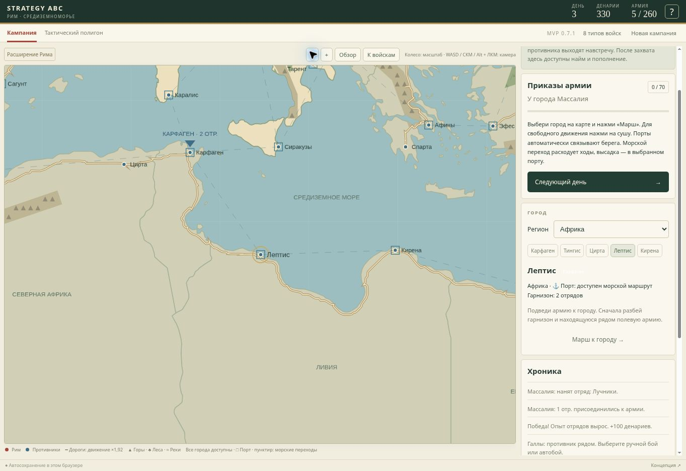

# 0.7.1 — непрерывные сухопутные дороги

Причина дефекта: в 0.7.0 города соединялись прямыми отрезками. При отрисовке эти отрезки обрезались по суше, создавая разрывы у заливов. Проверка движения при этом использовала исходные прямые линии.

В 0.7.1 действует единая сеть из 33 непрерывных дорог. Каждая начинается и заканчивается в городе, проходит через промежуточные точки и проверяется целиком на суше. Для больших маршрутов заданы географические коридоры: побережья Лигурии, Ронская долина, обход Сиртского залива, долины Дуная и Балкан, альпийские перевалы. Между точками используется сухопутный A* с высокой стоимостью скальных гор, штрафом для самой береговой кромки и небольшим штрафом леса. Это игровая сеть, а не точная датированная реконструкция античных дорог.

Геометрия упрощается с сохранением изгибов; сглаживание допускается только тогда, когда весь новый участок остаётся на суше. Нет операции обрезки дороги береговой линией. Карта и бонус движения используют один массив `src/road-network.ts`. Пространственный индекс позволяет проверять близость к подробным дорогам без перебора всей сети на каждом шаге.

Для регенерации потребуется Python с Shapely. Из корня репозитория:

```sh
node --experimental-strip-types --input-type=module -e "import {LAND,MOUNTAINS,INITIAL_CITIES} from './src/data.ts';import {FOREST_REGIONS} from './src/world-regions.ts';console.log(JSON.stringify({LAND,MOUNTAINS,INITIAL_CITIES,FOREST_REGIONS}))" > roads-input.json
python scripts/generate-roads.py
```

Проверки: каждый участок всех дорог с шагом не больше одной единицы лежит на суше; концы дорог совпадают с городами; дорога вдоль Сиртского залива действительно обходит его, сохраняя непрерывность; видимая дорога даёт бонус армии. Все 44 города остаются достижимыми. TypeScript, сборка и 71 тест, включая прежние тактические регрессии.

На опубликованной версии проверены непрерывный обход Сиртского залива на разных масштабах и сухопутный поход из Массалии к Лугдуну. Армия продвинулась по дороге и встретила отдельную полевую армию галлов. Существующая кампания 0.7.0 продолжилась после обновления.


