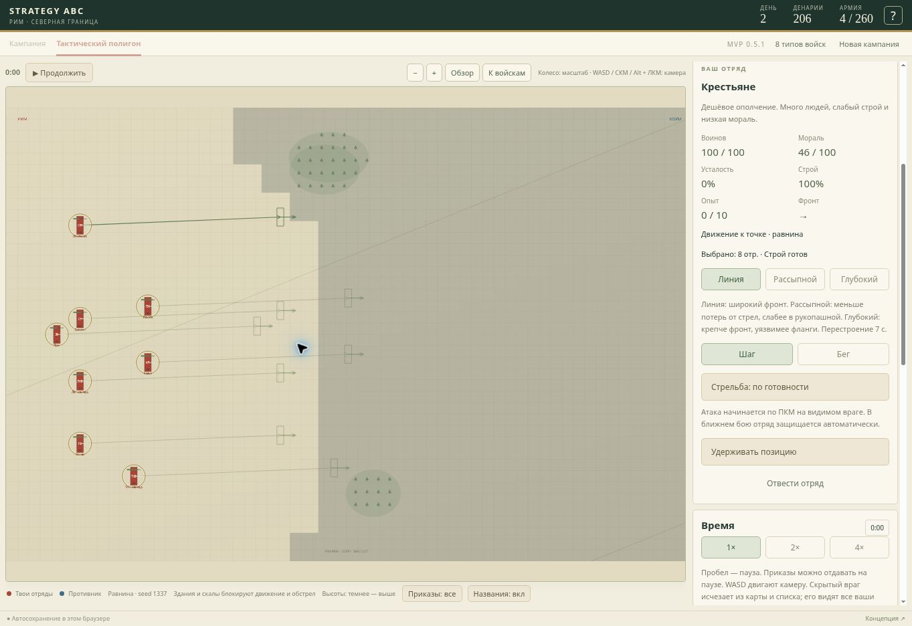

# Исправления тактического боя 0.5.1

## Три исправленные проблемы

1. Тяжёлая конница не догоняла лучников: её приказ атаки оставлял шаг (57), тогда как ИИ выбирал бег для лучников (36 × 1,65 = 59,4). В лесу множитель 0,42 для конницы против 0,72 для пехоты дополнительно давал преимущество бегущим людям. Теперь атака переводит конницу на бег, лес оставляет ей 65% скорости. Свежая тяжёлая конница догоняет бегущих лучников на равнине и в лесу; усталость и глубокий строй продолжают влиять на движение.

2. Вражеские отряды собирались в перекрывающийся комок: минимальная дистанция центров не учитывала ширину и глубину строя. Теперь столкновения учитывают размер и ориентацию отрядов, движение не проходит через другие боеспособные отряды, при необходимости выбирается обход. Контакт в ближнем бою определяется расстоянием между границами строя. Задние ряды не могут наносить ближний урон сквозь передние. ИИ оставляет стрелков за пехотой, конница предпочитает стрелков и обход подготовленного фронта копейщиков. На сближении без замеченного врага ИИ использует отдельные позиции вместо общей точки.

3. Групповой приказ разрушал расстановку: прежде он формировал единую линию по порядку ID в выделении. Теперь обычное перемещение переносит текущую расстановку без сортировки: пехота, стрелки и фланговые отряды сохраняют взаимные смещения. Перетаскивание ПКМ вращает расстановку целиком. Shift строит следующий этап от предыдущих назначенных позиций, даже пока войска ещё не достигли их.

## Проверки

48 тестов проходят, включая пять новых регрессионных проверок: тяжёлая конница догоняет лучников на равнине и в лесу; нерегулярная расстановка сохраняется при перемещении, очереди и повороте независимо от порядка выделения; три отряда, движущиеся к одной точке, не накладываются; стрелки ИИ выбирают укрытие за пехотой; конница ИИ выбирает фланговую точку против копейщиков.

Отдельно прогнаны полные бои восьми типов войск на равнине, в городе и лесу: в выборках боеспособные союзные отряды не пересекались. Автономная сборка проверена. Статические препятствия пока рассчитываются преимущественно по центру отряда; эта версия исправляет взаимное наложение отрядов, а не вводит физику каждого солдата.

Новые сценарии кампании в эту версию не включены.

## Проверка в браузере

На опубликованной версии 0.5.1 вручную расставлены пехота впереди, лучники позади и тяжёлая конница на нижнем фланге. После выделения всех восьми отрядов и обычного приказа перемещения будущие позиции сохраняют эту расстановку. Снимок сделан на паузе сразу после приказа; контуры справа показывают назначенные позиции.

