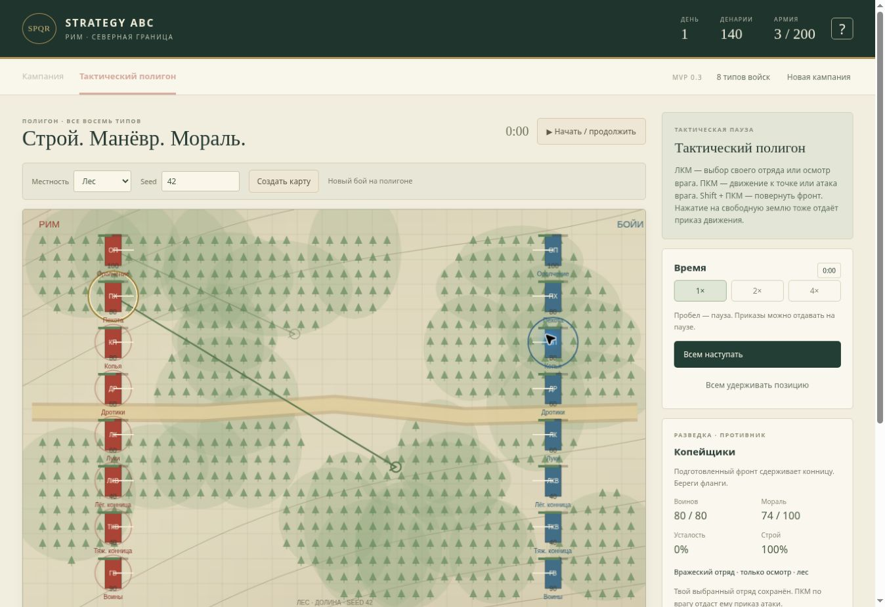

# MVP 0.3: управление и рельеф тактического боя

Изменения версии 0.4: [камера, расстановка и увеличенное поле](viewport.md).

## Выбор и команды

- ЛКМ по своим войскам выбирает отряд; ЛКМ по врагу открывает его имя, описание, численность, мораль, усталость и строй. Выбор своего отряда сохраняется.
- ПКМ по земле отдаёт выбранному отряду приказ движения. ПКМ по боеспособному врагу — приказ атаки.
- Shift + ПКМ задаёт направление фронта и удержание позиции.
- Нажатие ЛКМ на свободную землю также задаёт движение, как в предыдущей версии. Осмотр врага больше не запускает атаку.
- Стандартное контекстное меню отключено на игровой карте.
- Все свои приказы видны по умолчанию: зелёная стрелка движения, красная атаки, кольцо удержания. Выбранный приказ выделен сильнее. В списке своих войск есть текстовый статус каждого приказа.
- Переключатели под картой позволяют оставить только выбранный приказ и скрыть названия. Выбранные стрелки показывают радиус дальности. Радиус сам по себе не гарантирует обстрел: остаются проверки направления и препятствий.
- Противника также можно осмотреть через раскрывающийся список «Войска противника». Вражеские приказы не отображаются; команды им недоступны.

Осмотр противника и выбранный для командования отряд хранятся отдельно. Приказ возвращает боковую панель к своему отряду. На паузе можно спланировать несколько приказов и увидеть их одновременно.

## Единое поле высот

Вместо набора пересекающихся эллиптических холмов создаётся непрерывный рельеф:

| Профиль | Форма |
| --- | --- |
| Склон | Один край поля выше другого; направление определяется seed. |
| Долина | Изогнутое понижение между двумя высокими сторонами. |
| Гряда | Продолговатый изогнутый высокий участок с низинами по бокам. |
| Волнистая равнина | Плавные пологие перепады без резких отдельных кругов. |

Горы получают высокую гряду или долину, лес — склон/долину/гряду, город — небольшой склон, равнина — пологий склон или волны. Тип профиля подписан на карте. Деревья рассчитываются независимо от высот и могут покрывать склоны. Более тёмная заливка означает большую высоту; изолинии вычисляются из одного поля. Рельеф используется теми же функциями для визуализации, подъёма/усталости и преимущества по высоте.

Препятствия города и скалы остаются отдельными непроходимыми объектами. Проверка прямой видимости теперь использует точное пересечение отрезка с прямоугольником: прежняя проверка по точкам могла пропустить небольшой угол. Путь учитывает одинаковый отступ у здания при планировании и движении; отряды доходят до поворотных точек, чтобы не срезать угол.

## Сохранения и проверки

Текущая схема сохранений — 3, формат BattleMap — 2. Старые экспериментальные сохранения не переносятся; обновление начинает новую кампанию. Текущие сохранения и незавершённые бои восстанавливаются после перезагрузки.

25 автоматических проверок охватывают прежние механики, осмотр противника без изменения приказа, атаки ПКМ, защиту от командования чужими войсками, поворот фронта, предварительный путь движения, непрерывность высот, склон/долину/гряду, изолинии, обход угла здания и корректность сохранения.

Проверка опубликованной версии в браузере: осмотр врага без атаки, атака и движение ПКМ без контекстного меню, два видимых маршрута на паузе, переключатели приказов/названий, восстановление лесной карты seed 42 и приказов после перезагрузки.

