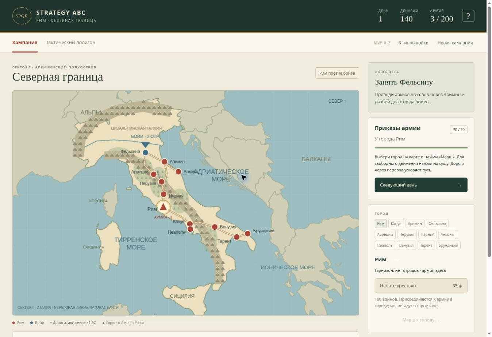
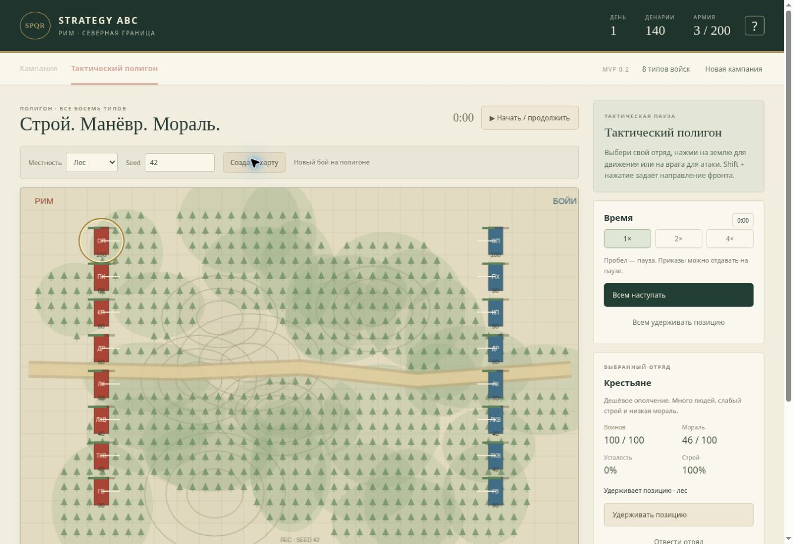
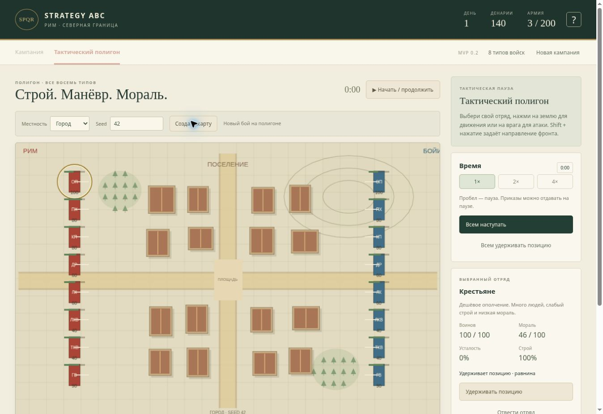

# MVP 0.2: Италия и процедурные поля боя

## Глобальная карта

Первый игровой сектор — материковая Италия. Корсика, Сардиния, Сицилия и соседние страны показаны как географический контекст, но пока не являются доступными секторами. Морские переходы отсутствуют.

Береговые контуры получены из [Natural Earth 1:50m](https://www.naturalearthdata.com/downloads/50m-cultural-vectors/50m-admin-0-countries-2/) — [публичные данные](https://www.naturalearthdata.com/about/terms-of-use/). В репозиторий включены только страны в окрестностях Италии. Исходный файл: [ne_50m_admin_0_countries.geojson](https://github.com/nvkelso/natural-earth-vector/blob/master/geojson/ne_50m_admin_0_countries.geojson). Координаты хранятся в src/geography.ts, проекция — в src/data.ts. Масштаб близок к географическому, но это игровая региональная карта, а не геодезическая карта.

Города привязаны к приблизительным координатам современных мест древних поселений: Рим, Капуя, Аримин, Фельсина, Арреций, Перузия, Нарния, Анкона, Неаполь, Венузия, Тарент и Брундизий. Для текущего сценария все, кроме Фельсины, доступны Риму. Это упрощение, а не точное распределение власти в конкретном году.

Показаны Альпы и Апеннины, лесистые области, По и Тибр. Горы, леса, реки и дороги вручную адаптированы для игры. Дорожные связи не претендуют на точное соответствие исторической сети. Реки пока только отображаются; горы блокируют перемещение вне дороги. Найм и доход работают во всех доступных римских городах.

Маршрут кампании рассчитывается на сетке 5 единиц. При привязке к сетке выбирается доступная точка, чтобы береговые города не становились недостижимыми из-за округления. Диагональные участки проверяются на пересечение моря и гор.

## Выбор поля боя

Кампания определяет тип карты по месту встречи — в текущем сценарии по позиции армии бойев:

1. Рядом с городом — городская карта с названием поселения.
2. В лесистой области — лесная карта, включая покрытые лесом холмы.
3. В горной области — горная карта с проходами.
4. В остальных случаях — равнина.

Seed вычисляется из координат встречи и игрового дня. Один и тот же контекст создаёт одну и ту же карту. Ручной бой, автобой и сохранение используют один объект BattleMap. Перезагрузка незаконченного боя не генерирует новое поле.

Бойи по-прежнему охраняют Фельсину, поэтому обычное столкновение с ними создаёт городскую карту. Для просмотра и проверки всех типов служит полигон. Будущие подвижные противники смогут использовать уже реализованную классификацию других мест встречи.

## Четыре генератора

| Тип | Содержание и тактическое влияние |
| --- | --- |
| Равнина | Большая открытая площадь, немного рощ и невысоких холмов; пространство для обхода. |
| Лес | Много перекрывающихся рощ, поляны и тропа, несколько возвышенностей. Конница замедляется, строй нарушается, стрелы менее эффективны. |
| Горы | Много высоких участков и непроходимые скальные массивы. Связные узкие проходы ограничивают манёвр; подъём замедляет и увеличивает усталость. |
| Город | Жилые кварталы, главная улица, поперечная улица и площадь. Здания непроходимы и закрывают обстрел. |

На полигоне можно выбрать тип и ввести seed от 0 до 4294967295. «Создать карту» начинает новый бой с полными армиями и ставит его на паузу. На паузе поля редактируются без сброса введённых значений; во время боя они отключены.

## Механика рельефа и препятствий

Высота — сумма плавных холмов. Перепад высоты между отрядами влияет на урон в ограниченном диапазоне; подъём уменьшает скорость. Лес рассчитывается независимо от высоты, поэтому может покрывать холмы. Тропа создаёт просвет в деревьях.

Отряды используют локальный A* вокруг зданий и скал, с учётом собственного отступа от препятствия. Прямой приказ в непроходимую точку отклоняется. Путь обновляется при движении цели; соседние отряды не выталкиваются внутрь препятствий. Здания и скалы также проверяются при нанесении урона: стрелять и сражаться через них нельзя.

Это ещё не осады: у города нет разрушаемых стен, ворот, гарнизонной системы штурма или захвата отдельных зданий. Высоты и застройка — процедурная игровая модель, а не восстановление конкретного древнего города.

## Совместимость сохранений

Схема сохранений обновлена до 2. Сохранение 0.1 переносит казну, день, состав и численность армий, гарнизоны и контроль старых городов. Положение армии переносится к ближайшему прежнему городу на новой карте; запланированный маршрут пересчитывается. Незавершённый старый бой сохраняет войска и потери и получает совместимую старую геометрию поля. Новые города добавляются автоматически.

## Проверки

19 тестов: прежние правила игры, доступность всех 12 городов, воспроизводимость и разнообразие seed, покрытие лесом, здания/скалы и обстрел, связность проходов на нескольких seed, обход здания отрядом, выбор местности по географии, завершение автобоя на четырёх типах карт, перенос старого сохранения и отклонение повреждённого рельефа.

Проверено на опубликованной GitHub Pages версии: перенос сохранения 0.1, карта Италии с 12 городами, генерация равнины/леса/гор/города, seed 42, восстановление городской карты после перезагрузки и переход из кампании к бою в Фельсине.

